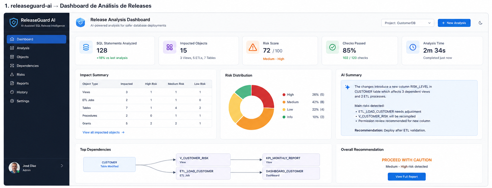
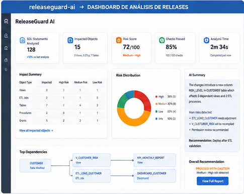
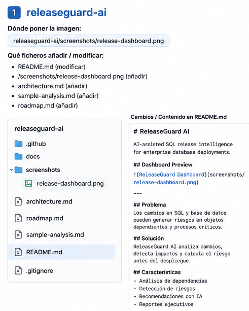

# ReleaseGuard AI

AI-assisted release intelligence for SQL and Oracle environments.

---

## Dashboard Preview







---

## Dependencies & Impact Analysis




---

## Problem

Many enterprise teams still validate database releases manually.

This creates:

- production risk
- undocumented changes
- permission issues
- broken dependencies
- slow release cycles

## What ReleaseGuard AI does

ReleaseGuard AI analyzes SQL release scripts and generates automated release intelligence reports.

## Current concept features

- SQL impact analysis
- Permission change detection
- AI-generated summaries
- Changelog generation
- Risk scoring
- Dependency analysis

## Example input

```sql
ALTER TABLE POLICY_CUSTOMERS
ADD EMAIL VARCHAR2(200);

GRANT SELECT ON POLICY_CUSTOMERS TO REPORTING_ROLE;
```

## Example output

```text
Affected objects:
- POLICY_CUSTOMERS

Detected changes:
- New column: EMAIL
- Permission change detected

Potential risks:
- Sensitive field introduced
- Reporting access expanded

Suggested validations:
- Check ETL mappings
- Validate masking policies

Risk level: LOW
```

## Architecture

```text
SQL Scripts
    ↓
Parser Engine
    ↓
Impact Analyzer
    ↓
Risk Detection
    ↓
AI Summary Layer
    ↓
Release Intelligence Report
```

## Documentation

See:
sample-analysis.md
architecture.md
roadmap.md


## Roadmap

- Oracle parser
- Changelog generator
- Risk engine
- Dependency graph
- GitHub Actions integration# releaseguard-ai
AI-assisted SQL release intelligence for enterprise database deployments.
